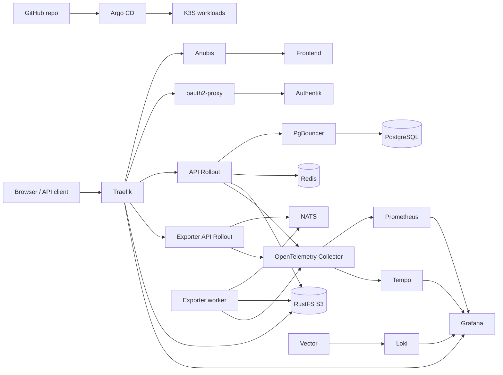

# DreamTeams Deploy

Infrastructure, deployment automation, and GitOps configuration for DreamTeams.

## What this repository provides

- A local K3S deployment profile for development and integration testing.
- A production bootstrap path using Ansible and k3s.
- Argo CD application manifests for reproducible GitOps deployment.
- First-party Helm charts for DreamTeams services and supporting glue.
- Traefik routing, middleware, TLS certificates, rate limits, security headers, and network policies.
- A complex observability stack with Prometheus, Grafana, Loki, Tempo, Vector, OpenTelemetry Collector, Alertmanager, node-exporter, and kube-state-metrics.

## Features

- **GitOps deployment**: Argo CD continuously reconciles local and production environments from declarative application manifests.
- **Environment-specific profiles**: local K3S uses plaintext fake secrets and self-signed certificates, while production uses SealedSecrets and Let's Encrypt.
- **Automated cluster bootstrap**: Ansible provisions VDS nodes, installs k3s, hardens SSH/firewall defaults, installs Argo CD, and applies production apps.
- **Progressive delivery**: API and exporter API releases use Argo Rollouts canaries with Prometheus-based 5xx analysis before full promotion.
- **Identity and access control**: Authentik provides DreamTeams OIDC flows, while oauth2-proxy protects authenticated application routes.
- **Edge protection**: Traefik handles TLS, redirects, route-specific rate limits, request size limits, security headers, compression, and public cache middleware.
- **Bot mitigation**: Anubis gates the public web entrypoint before traffic reaches the frontend.
- **Observability**: metrics, logs, traces, alerts, and dashboards are deployed with Prometheus, Loki, Tempo, Vector, OpenTelemetry Collector, Alertmanager, and Grafana.
- **Secure runtime posture**: charts default to non-root containers, dropped capabilities, disabled privilege escalation, restricted service account tokens, and NetworkPolicy isolation.
- **Operational runbooks**: `just` recipes cover local sync, Argo CD access, production bootstrap, SealedSecrets sealing, tunnels, and observability sandbox workflows.

## Technology Stack

| Area | Technology |
| --- | --- |
| Cluster runtime | K3S |
| GitOps controller | Argo CD |
| Packaging | Helm |
| Server bootstrap | Ansible, k3s-ansible |
| Ingress | K3S Traefik with Traefik CRDs |
| Progressive delivery | Argo Rollouts canary rollouts |
| TLS | cert-manager, self-signed local issuer, Let's Encrypt production issuer |
| Secret management | Plain local Secret manifests, Bitnami SealedSecrets in production |
| Frontend runtime | Static Nuxt build served by nginx |
| Backend runtime | `ghcr.io/lubaskinc0de/dreamteams` API container |
| Export runtime | `ghcr.io/lubaskinc0de/dreamteams` exporter API and worker |
| Database | PostgreSQL 17 via Bitnami chart |
| Database pooling | PgBouncer |
| Cache/session storage | Redis via Bitnami chart |
| Queue/streaming | NATS JetStream |
| Object storage | RustFS S3-compatible storage |
| Identity provider | Authentik |
| Application auth gateway | oauth2-proxy with OIDC and Redis session store |
| Bot protection | Anubis in front of the web entrypoint |
| Metrics | Prometheus |
| Dashboards | Grafana |
| Logs | Vector and Loki |
| Traces | OpenTelemetry Collector and Tempo |
| Load testing sandbox | k6 through Docker Compose |
| Task runner | just |

## Repository Layout

```text
.
|-- apps/
|   |-- local/                 # Argo CD Applications for local K3S
|   |-- prod/                  # Argo CD Applications for production
|   `-- prod-root.yaml         # Root app for app-of-apps production management
|-- ansible/                   # Production host and cluster bootstrap
|   |-- inventory/             # Server and agent inventory
|   |-- group_vars/            # Bootstrap variables and vault secrets
|   `-- roles/                 # VDS setup, firewall, Argo CD, post-bootstrap hardening
|-- dreamteams_api/            # API Helm chart
|-- dreamteams_frontend/       # Static frontend Helm chart
|-- dreamteams_exporter/       # Exporter API and worker Helm chart
|-- dreamteams_migrations/     # Database migration Job chart
|-- dreamteams_ingress/        # Traefik routing, middleware, TLS, NetworkPolicy
|-- dreamteams_authentik/      # Authentik wrapper and DreamTeams OIDC blueprint
|-- dreamteams_oauth2proxy/    # oauth2-proxy wrapper
|-- dreamteams_anubis/         # Anubis bot-protection deployment
|-- dreamteams_postgres/       # PostgreSQL wrapper chart
|-- dreamteams_pgbouncer/      # PgBouncer chart
|-- dreamteams_redis/          # Redis wrapper chart
|-- dreamteams_nats/           # NATS JetStream chart and stream bootstrap Job
|-- dreamteams_rustfs/         # RustFS wrapper and bucket bootstrap Job
|-- dreamteams_cert_issuer/    # Local/prod ClusterIssuer chart
|-- k3s_traefik_config/        # K3S Traefik HelmChartConfig
|-- observability/             # Kubernetes and Docker observability stack
|-- local/                     # Local-only fake secrets and CoreDNS helpers
|-- sealed-secrets/prod/       # Production encrypted SealedSecret manifests
`-- Justfile                   # Common local, production, Argo CD, and secret commands
```

## Architecture

DreamTeams is deployed as a set of independently managed Argo CD Applications. Argo CD watches this repository, renders Helm charts, and reconciles the cluster to the desired state.



### Runtime Components

- `dreamteams-api` runs the application API on port `5000`. It mounts `config.toml` from `dreamteams-api-config`, connects to PgBouncer, Redis, RustFS, and emits telemetry to the observability stack.
- `dreamteams-frontend` serves a static Nuxt build through nginx. Runtime public settings are exposed through `/config.js`, so host/API configuration can change without rebuilding the frontend image.
- `dreamteams-migrations` runs database migrations as a Kubernetes Job before the application services are expected to serve traffic.
- `dreamteams-exporter` has two components: an API on port `8001` and a background worker. The API accepts export requests, while the worker processes queued jobs through NATS JetStream and writes generated artifacts to RustFS.
- `dreamteams-postgres` stores application data. The API connects through PgBouncer instead of connecting directly to PostgreSQL.
- `dreamteams-redis` is used for app/cache needs, oauth2-proxy sessions, and Traefik distributed rate-limit state.
- `dreamteams-nats` provides JetStream for exporter job processing. A bootstrap Job creates the `exporter` stream.
- `dreamteams-rustfs` provides S3-compatible object storage and a bucket bootstrap Job.
- `dreamteams-authentik` provides identity, OIDC, registration, login, recovery, and email verification flows.
- `dreamteams-oauth2proxy` protects authenticated routes using Authentik as the OIDC provider.
- `dreamteams-anubis` gates the public web entrypoint before requests are passed back to Traefik's internal entrypoint.
- `dreamteams-observability` deploys metrics, logs, traces, dashboards, and alerting.

## GitOps Model

The `apps/local/` and `apps/prod/` directories contain Argo CD `Application` manifests. Each application points at one Helm chart or upstream chart and uses sync waves to make ordering explicit.

Important sync waves:

| Wave | Purpose |
| --- | --- |
| `-5` | K3S Traefik configuration |
| `-4` | Argo Rollouts CRDs/controllers |
| `-3` | cert-manager |
| `-2` | certificate issuer and SealedSecrets controller in production |
| `-1` | local Secrets or production SealedSecrets |
| `0` | stateful dependencies: Postgres, Redis, RustFS, NATS, Authentik |
| `1` | PgBouncer and ingress policy |
| `2` | migrations and oauth2-proxy |
| `3` | API, exporter, frontend, Anubis |
| `5` | observability |

Production also includes `apps/prod-root.yaml`, an app-of-apps root application that watches `apps/prod`.

Most applications enable:

- `automated.prune`: removes Kubernetes objects that are no longer declared.
- `automated.selfHeal`: restores drifted cluster objects.
- `PruneLast=true`: delays pruning until the rest of a sync has completed.
- `SkipDryRunOnMissingResource=true`: allows CRD-owning apps and CRD-consuming apps to coexist during first syncs.

## Delivery Approach

The API and exporter API use Argo Rollouts instead of plain Deployments. Their rollout strategy is:

1. Start a canary with `maxSurge: 1` and `maxUnavailable: 0`.
2. Send 50 percent of traffic to the new version.
3. Run a Prometheus-backed `AnalysisTemplate`.
4. Promote to 100 percent only if the 5xx rate stays below the configured threshold.

The analysis query reads `http_server_duration_milliseconds_count` from Prometheus and requires a minimum amount of recent traffic before evaluating the error percentage. This gives deployments a basic automated guardrail against obvious server-side regressions.

## Ingress, Auth, and Routing

Routing highlights:

- HTTP is redirected to HTTPS except ACME challenge paths.
- Optional apex host redirect sends the bare/root domain to the application host.
- `/logout` is rewritten to oauth2-proxy sign-out and then to Authentik end-session.
- `/oauth2/*` routes to oauth2-proxy.
- Authenticated API routes use oauth2-proxy forward auth.
- Avatar upload routes have a request body limit.
- Public preview/object routes can use Traefik's `simplecache` plugin.
- API docs can be blocked or IP-allowlisted.
- RustFS is available through both same-origin `/s3` and the dedicated S3 host.
- Grafana and Authentik are routed on their own hostnames.

Security and traffic controls:

- Security headers include frame deny, content type nosniff, no-referrer policy, and a restrictive permissions policy.
- Production values enable HSTS for the application host.
- Distributed Traefik rate limits use Redis DB `4`.
- Different routes have different limits: frontend, oauth2, API default/write, identity writes, avatar upload, export create/poll, S3, Authentik, and Grafana.
- Public client IP forwarding headers are cleared at the edge.
- K3S Traefik is configured as a DaemonSet with `externalTrafficPolicy: Local` so source IP based rate limits see the original client IP.

## Identity

Authentik is installed through the upstream Authentik chart and extended with DreamTeams-specific configuration:

- OIDC provider/application blueprint for DreamTeams.
- Email-only authentication flow.
- Registration flow with email, password, repeated password, and mandatory email-code verification.
- Password recovery flow.
- Custom email templates mounted from a ConfigMap.
- Russian user-facing text configured under `dreamteamsOidc.text`.

OIDC credentials are shared between Authentik and oauth2-proxy:

- Authentik reads `DREAMTEAMS_OIDC_CLIENT_ID` and `DREAMTEAMS_OIDC_CLIENT_SECRET` from the `authentik-env` Secret.
- oauth2-proxy reads matching `client-id` and `client-secret` keys from `dreamteams-oauth2proxy-secret`.

Registrations require Authentik global SMTP settings in `authentik-env` using the relevant `AUTHENTIK_EMAIL__...` variables.

## Secrets

Local and production secrets intentionally use different workflows.

- Local: `local/secrets.yaml` contains fake plaintext secrets for local-only K3S use.
- Production: `sealed-secrets/prod/` contains encrypted `SealedSecret` manifests that can only be decrypted by the target cluster's SealedSecrets controller.

Production bootstrap validates that required secrets are represented before applying the full stack. Required production secrets include API, exporter, migrations, PostgreSQL, PgBouncer, RustFS, oauth2-proxy, Authentik, Grafana, Alertmanager, and GHCR pull credentials.

Expected production secret names:

- `dreamteams-api-config`
- `dreamteams-exporter-config`
- `dreamteams-migrations-config`
- `dreamteams-postgres-secret`
- `dreamteams-postgres-initdb`
- `dreamteams-pgbouncer-secret`
- `dreamteams-rustfs-secret`
- `dreamteams-oauth2proxy-secret`
- `authentik-env`
- `authentik-postgres-secret`
- `grafana-admin`
- `alertmanager-config`
- `ghcr-secret`

To seal a production Secret:

```bash
just prod-fetch-cert
just seal-prod /tmp/secret.yaml sealed-secrets/prod/secret-name.yaml
```

For a brand-new production cluster where no valid SealedSecrets certificate exists yet, use the first-run process in [First Production SealedSecrets Run](#first-production-sealedsecrets-run).

## Security Posture

The charts use a restrictive default runtime posture:

- Service account token automounting is disabled where it is not needed.
- Containers run as non-root users.
- Privilege escalation is disabled.
- Linux capabilities are dropped.
- Seccomp `RuntimeDefault` is used.
- Several components use read-only root filesystems.
- NetworkPolicy is enabled for the application namespace with default deny and explicit ingress/egress rules.
- Argo CD is kept on a ClusterIP service and accessed through port-forwarding or SSH tunnels.
- Production bootstrap disables SSH password login after creating the deploy user.
- UFW, fail2ban, and unattended upgrades are configured by Ansible.
- Kubernetes API access is not opened publicly by default.

## Observability

The Kubernetes observability chart deploys:

- Prometheus for metrics and rollout analysis.
- Alertmanager for alert routing.
- Grafana with provisioned dashboards and datasources.
- Loki for logs.
- Tempo for traces.
- OpenTelemetry Collector for telemetry ingestion.
- Vector for log collection.
- node-exporter and kube-state-metrics for infrastructure metrics.

Shared observability assets:

- Alert rules: `observability/prometheus-rules/`.
- Grafana dashboards: `observability/grafana/provisioning/dashboards/`.
- System log dashboards: `observability/grafana/provisioning/system-log-dashboards/`.
- Datasources: `observability/grafana/provisioning/datasources/`.
- Kubernetes Prometheus config: `observability/prometheus.kubernetes.yml`.
- Docker Compose Prometheus config: `observability/prometheus.yml`.
- Kubernetes Vector config: `observability/vector.kubernetes.yaml`.
- Docker Compose Vector config: `observability/vector.docker.yaml`.

A Docker Compose observability sandbox is also available for non-K3S local runs.

Provisioned Grafana dashboards cover application latency and traffic, Kubernetes health, logs, traces, and infrastructure signals.

<p align="center">
  
</p>

<p align="center">
  
</p>

<p align="center">
  
</p>

<p align="center">
  
</p>

## Local K3S

### Prerequisites

- K3S with Traefik enabled.
- `kubectl`.
- `helm`.
- `argocd` CLI.
- `just`.
- Argo CD installed in the `argocd` namespace.

Install Argo CD if needed:

```bash
helm repo add argo https://argoproj.github.io/argo-helm
helm repo update
helm upgrade --install argocd argo/argo-cd -n argocd --create-namespace \
  --set server.service.type=ClusterIP \
  --set configs.rbac.policy\\.csv="g, admin, role:admin" \
  --wait
```

Apply and sync the local stack:

```bash
just local-k3s-up
just argocd-login
just local-sync
```

Argo CD UI is intentionally not exposed through the cluster LoadBalancer, so it does not compete with Traefik for ports `80` and `443`. Use a local port-forward when you need the UI:

```bash
just argocd-web 8080
```

Then open:

```text
https://localhost:8080
```

Local hosts:

- `https://dreamteams.localhost`
- `https://s3.dreamteams.localhost`
- `https://auth.dreamteams.localhost/if/flow/initial-setup/`
- `https://grafana.dreamteams.localhost`

The local issuer is self-signed, so browser warnings and `curl -k` are expected. If your resolver does not handle nested `.localhost` names, add these to `/etc/hosts`:

```text
127.0.0.1 dreamteams.localhost s3.dreamteams.localhost auth.dreamteams.localhost grafana.dreamteams.localhost
```

Local secrets live in `local/secrets.yaml` and are intentionally fake.

If you import local images directly into K3S/containerd, override the relevant Helm values in the local Argo CD app:

- API, migrations, exporter: `image.repository`, `image.tag`, `image.pullPolicy`.
- Frontend: `image.repository`, `image.tag`, `image.pullPolicy`.

If you reuse an old local PVC, PostgreSQL init scripts will not run again. Delete the local DreamTeams PVCs before a clean re-test.

### Local Observability Sandbox

The Docker Compose observability sandbox starts Grafana, Prometheus, Loki, Tempo, OpenTelemetry Collector, Vector, Alertmanager, Mailpit, and demo traffic tooling.

```bash
just observe
SUPERUSER_PASSWORD=asd123321 just demo-traffic
```

Alertmanager sends local alert emails to Mailpit:

```text
http://localhost:8025
```

Clear the sandbox:

```bash
just observe-clear
```

## Production

### Before Deploying

Review and update production-specific values:

- `ansible/group_vars/all.yaml`: `app_host`, `auth_host`, `s3_host`, `grafana_host`, `letsencrypt_email`, `deploy_repo`, and `deploy_repo_revision`.
- `apps/prod/ingress.yaml`: public hostnames, issuer name, HSTS, apex redirect, and API docs access.
- `apps/prod/frontend.yaml`: `runtimeConfig.apiBase`.
- `apps/prod/oauth2proxy.yaml`: redirect URL, issuer URL, whitelist domains, and hostnames.
- `dreamteams_authentik/values-prod.yaml`: OIDC redirect URI hostname.
- `sealed-secrets/prod/`: real production secrets for every required secret.
- DNS: `A` records for app, auth, S3, and Grafana hosts.
- Backups: PostgreSQL and object storage backups are not created by this repository yet.

Production currently targets `dreamteams.luba.skin` and related subdomains in checked-in values. Change these before deploying a different environment.

### VDS Bootstrap

The Ansible bootstrap always applies `apps/prod/`. Kubernetes API is not opened to the public internet by default; manage the cluster over SSH from the first control-plane node.

From a fresh VDS:

1. Buy a server with Ubuntu/Debian and public IPv4. At the provider firewall level, allow at least TCP `22`, `80`, and `443`.
2. Point DNS `A` records to the server IP: application, auth, S3, and Grafana hostnames.
3. Generate an SSH key if needed:

```bash
ssh-keygen -t ed25519 -f ~/.ssh/dreamteams_prod
```

4. Fill `ansible/inventory/hosts.yml`.
5. Set production hosts in `ansible/group_vars/all.yaml`.
6. If `deploy_repo` is an SSH URL, put the deploy key in Ansible Vault as `deploy_repo_ssh_private_key` or `ssh_private_key`:

```bash
ansible-vault edit ansible/group_vars/secrets.yml
```

7. Export SSH connection values:

```bash
export ANSIBLE_USER=root
export ANSIBLE_PRIVATE_KEY_FILE=~/.ssh/dreamteams_prod
export SSH_PUBLIC_KEY="$(cat ~/.ssh/dreamteams_prod.pub)"
```

8. Record each server SSH host key only after verifying the provider fingerprint:

```bash
just prod-known-host YOUR_SERVER_IP SHA256:EXPECTED_SERVER_FINGERPRINT
```

9. Install Ansible collections:

```bash
just ansible-install
```

10. Run bootstrap.

If the provider already installed your SSH public key for root:

```bash
just prod-bootstrap
```

If the provider only gave a root SSH password:

```bash
just prod-bootstrap-password
```

The playbook:

- Validates topology, production variables, required SealedSecrets, and SSH known hosts.
- Creates the `deploy` user.
- Installs your SSH key.
- Disables SSH password login.
- Enables UFW, fail2ban, and unattended upgrades.
- Installs k3s.
- Re-locks firewall rules after k3s-ansible setup.
- Installs Argo CD.
- Registers the deploy repository.
- Applies production Argo CD applications and the production root app.
- Installs a small cluster operations `Justfile` on the control-plane node.

For HA with embedded etcd, k3s requires an odd number of server nodes. This playbook accepts `1`, `3`, `5`, or `7` server nodes. Without an external API load balancer, the first server is used as `api_endpoint`.

### First Production SealedSecrets Run

For a brand-new production cluster, SealedSecrets must be sealed with a certificate that the target cluster's controller can decrypt.

If valid production SealedSecrets already exist, run the normal bootstrap.

If this is the first ever production cluster and prod SealedSecrets do not exist yet, run an infrastructure-only bootstrap first:

```bash
just prod-bootstrap-infra
```

or, with a provider root password:

```bash
just prod-bootstrap-infra-password
```

That run installs k3s, Argo CD, cert-manager, and the SealedSecrets controller, but application pods may wait for missing secrets. Fetch the SealedSecrets cert from the control-plane node:

```bash
just prod-fetch-cert-ssh YOUR_SERVER_IP /tmp/prod-cert.pem
```

Seal real production secrets with that cert, commit and push them to `sealed-secrets/prod/`, then rerun:

```bash
just prod-bootstrap
```

or sync from the control-plane node:

```bash
ssh deploy@YOUR_SERVER_IP
just argocd-refresh
just argocd-sync-all
```

### Production Argo CD UI

Argo CD is intentionally not exposed publicly. Open it through an SSH tunnel:

```bash
just prod-argocd-tunnel YOUR_SERVER_IP
```

Then open:

```text
https://localhost:8080
```

Print the initial/admin password over SSH:

```bash
just prod-argocd-password YOUR_SERVER_IP
```

### Control-Plane Operations

After bootstrap, SSH into the first control-plane node as `deploy`. Ansible installs an ops `Justfile` at `/home/deploy/cluster-ops/Justfile` and links it as `/home/deploy/Justfile`.

Useful commands on the server:

```bash
ssh deploy@YOUR_SERVER_IP
just nodes
just pods
just apps
just ingress
just secrets-status
just firewall
```

## Common Commands

| Command | Purpose |
| --- | --- |
| `just --list` | Show all recipes |
| `just local-k3s-up` | Apply local Argo CD Applications |
| `just argocd-login` | Log in to local Argo CD through port-forward |
| `just local-sync` | Sync the local stack in dependency order |
| `just local-status` | List local Argo CD apps |
| `just argocd-web 8080` | Open local Argo CD UI through port-forward |
| `just observe` | Start Docker Compose observability sandbox |
| `just observe-clear` | Remove Docker Compose observability sandbox volumes |
| `just demo-traffic` | Run k6 demo traffic |
| `just ansible-install` | Install Ansible collections |
| `just prod-known-host HOST FINGERPRINT` | Safely record a production SSH host key |
| `just prod-bootstrap` | Bootstrap production using SSH key auth |
| `just prod-bootstrap-password` | Bootstrap production using root password auth |
| `just prod-bootstrap-infra` | First infrastructure run before prod SealedSecrets exist |
| `just prod-argocd-tunnel HOST` | Open production Argo CD through SSH tunnel |
| `just prod-fetch-cert` | Fetch SealedSecrets cert from current kubecontext |
| `just prod-fetch-cert-ssh HOST /tmp/prod-cert.pem` | Fetch SealedSecrets cert over SSH |
| `just seal-prod INPUT OUTPUT` | Seal a Secret manifest for production |

## Validation

Render and lint charts locally before pushing deployment changes:

```bash
helm dependency update dreamteams_authentik
helm dependency update dreamteams_oauth2proxy
helm dependency update dreamteams_postgres
helm dependency update dreamteams_redis
helm dependency update dreamteams_rustfs

for chart in dreamteams_api dreamteams_migrations dreamteams_exporter dreamteams_frontend \
  dreamteams_pgbouncer dreamteams_nats dreamteams_cert_issuer dreamteams_ingress \
  dreamteams_anubis k3s_traefik_config observability dreamteams_postgres \
  dreamteams_redis dreamteams_rustfs dreamteams_oauth2proxy dreamteams_authentik; do
  release=$(printf '%s' "$chart" | tr '_' '-')
  helm template "$release" "./$chart" >/tmp/$chart.yaml
  helm lint "./$chart"
done
```
